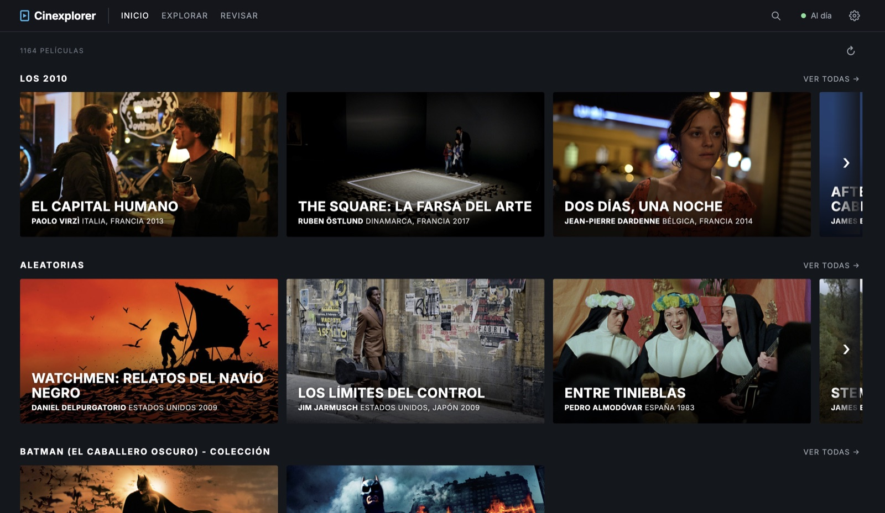

# Cinexplorer

[English](README.md) · **Español**



Explorador local de una colección de películas. Recorre las carpetas que le
indiques, arma un catálogo (qué película es cada archivo, en qué versiones la
tenés, con qué calidad, subtítulos y duplicados) y lo muestra en el navegador.
No importa cómo estén organizadas las carpetas en disco.

- **Solo lectura:** nunca mueve, renombra ni borra archivos de video. Lo único
  que escribe es su propio catálogo, junto al ejecutable.
- **Portátil:** un ejecutable por sistema, sin instalador ni dependencias. El
  catálogo guarda rutas relativas, así que el mismo disco externo funciona en
  Windows, macOS y Linux.
- **Local:** el servidor escucha solo en `127.0.0.1`. La red se usa únicamente
  para consultar TMDB y Wikidata (opcional).

## Estado

El proyecto avanza por etapas (ver `docs/superpowers/specs/`):

| Etapa | Contenido | Estado |
|---|---|---|
| 1. Núcleo | escaneo, parser de nombres, versiones, catálogo SQLite, API | ✅ |
| 2. Datos técnicos | lectura de encabezados MKV/MP4/AVI/IFO, `ffprobe` opcional, mejor versión | ✅ |
| 3. Identificación | TMDB + Wikidata, puntaje de confianza, correcciones, afiches | ✅ |
| 4a. Catálogo navegable | interfaz Svelte: Explorar con facetas, Ficha, Revisar | ✅ |
| 4b. Descubrimiento | Inicio, búsqueda instantánea, asistente de primer uso, Ajustes | ✅ |
| 5. Curaduría | listas, etiquetas, importación de `Collections/` | pendiente |

La interfaz tiene estas partes:

- **Inicio:** filas de imágenes de escena al estilo de MUBI: lo agregado
  recientemente y, sorteadas en cada visita, una década, un director, un país,
  un género y una colección. Cada fila lleva a Explorar con ese filtro. El
  botón ↻ sortea otras.
- **Búsqueda** (la lupa, o Ctrl+K / ⌘K): resultados mientras escribís, por
  título, título original, director, reparto o nombre de archivo, sin importar
  tildes ni mayúsculas. Enter abre la página con todos los resultados.

- **Explorar:** la colección como grilla de afiches, con facetas combinables
  (década y año, director, género, país, resolución, subtítulos, idioma
  original, colección, ubicación en disco y estado) y orden por año, título,
  fecha de alta o tamaño. Los filtros quedan en la dirección de la página, así
  que se pueden guardar como favoritos y el botón "atrás" funciona. Lo que
  todavía no está identificado aparece igual, con un afiche genérico.
- **Ficha de cada película:** datos de TMDB y, debajo, cada versión en disco
  con su calidad, audio, subtítulos, la marca **MEJOR** y **COPIA IDÉNTICA**,
  y los botones ▶ Ver y Carpeta. El menú ⋯ de cada versión corrige la
  identificación. Una película guardada en varios archivos (`Parte 1`, `CD2`…)
  es una sola versión; cuando los nombres difieren después de la marca también
  se agrupan, y ⋯ → *Es una parte de…* une dos versiones cualquiera a mano.
- **Revisar:** la cola de **Sin identificar** (candidatos, búsqueda manual, "no
  es una película", "es un extra de…", con atajos de teclado) y los
  **Duplicados** (copias idénticas y varias versiones de una película, con el
  espacio que se podría recuperar).

- **Ajustes** (el engranaje): carpetas, token de TMDB, idioma de los datos y
  descarga de imágenes. Los cambios se aplican sin reiniciar la app.

Un indicador arriba a la derecha muestra el escaneo y la identificación en
curso; las páginas se actualizan solas a medida que avanzan.

## Requisitos

Para usarlo:

- Nada obligatorio: el ejecutable es autocontenido.
- **Token de TMDB** (gratuito), para identificar películas. Creá una cuenta en
  [themoviedb.org](https://www.themoviedb.org/), entrá a *Settings → API* y
  copiá el **API Read Access Token**: es el largo, empieza con `eyJ…`; no sirve
  la "API Key" corta. Sin token, la app funciona igual pero no identifica.
- **`ffprobe`** (opcional, parte de [FFmpeg](https://ffmpeg.org/)): si está en
  el `PATH`, se usa para los formatos que la app no lee por su cuenta (RMVB, MPG,
  WMV…) o cuando un encabezado no se puede leer. Si lo instalás después, hay que
  reiniciar la app; los archivos que habían fallado se vuelven a analizar solos.

Para compilarlo: Go 1.27 o posterior; Node 22.12 o posterior solo para
modificar la interfaz (ver [Desarrollo](#desarrollo)).

## Instalación

La disposición pensada es un disco (interno o externo) con las películas y, al
lado, la carpeta de la app:

```
<raíz del disco>/
├── cine/                       ← tus películas, organizadas como quieras
├── cine-ordenar/
└── cinexplorer/
    ├── cinexplorer-windows.exe
    ├── cinexplorer-macos       (binario universal Intel + Apple Silicon)
    ├── cinexplorer-linux
    ├── config.json             (se crea en el primer uso)
    ├── cinexplorer.db          (el catálogo, SQLite)
    └── cache/                  (afiches e imágenes de TMDB)
```

1. Copiá la carpeta `cinexplorer/` a la raíz del disco, al lado de tus carpetas
   de películas.
2. Ejecutá el binario de tu sistema:
   - Windows: `cinexplorer-windows.exe`
   - macOS: `cinexplorer-macos`. La primera vez, clic derecho → Abrir, porque
     no está firmado. Si macOS sigue bloqueándolo:
     `xattr -d com.apple.quarantine cinexplorer-macos`.
   - Linux: `./cinexplorer-linux` (puede hacer falta `chmod +x` antes).
3. Se abre el navegador con el asistente de primer uso, en tres pasos:
   - **Carpetas:** propone las que están al lado de `cinexplorer/` (ignora las
     ocultas y las del sistema, como `$RECYCLE.BIN` o `System Volume
     Information`); se pueden desmarcar o agregar otras escribiendo la ruta.
   - **Token de TMDB:** pegalo y verificalo (ver [Requisitos](#requisitos)).
     Se puede seguir sin token y cargarlo después en Ajustes.
   - **Idioma** de títulos y sinopsis: español (Argentina), inglés (EE. UU.) o
     portugués (Brasil).
4. Al terminar se guarda `config.json` y empieza el escaneo; el Inicio se va
   llenando a medida que se identifican las películas. El primer escaneo
   analiza todo; los siguientes solo lo que cambió.

Para salir, cerrá la ventana de la terminal (o Ctrl+C).

## Configuración

Todo se cambia desde **Ajustes**, en la app. Queda guardado en `config.json`,
junto al ejecutable:

```json
{
  "roots": ["../cine", "../cine-ordenar"],
  "tmdbToken": "eyJ…",
  "language": "es-AR",
  "imagePrefetch": "none"
}
```

| Campo | Qué es |
|---|---|
| `roots` | Carpetas a escanear, **relativas a la carpeta de la app** y con `/` como separador (tienen que estar en el mismo disco que la app). Una raíz que no está disponible (por ejemplo, un disco desenchufado) se saltea sin tocar lo que ya había en el catálogo. Los archivos de una raíz que se quita pasan a "no encontrado". |
| `tmdbToken` | Token de lectura de TMDB (v4). Vacío: no se identifica. |
| `language` | Idioma de títulos, sinopsis y géneros: `es-AR` (por defecto), `en-US` o `pt-BR`. Lo que TMDB no tiene traducido a esa variante se toma de la más cercana (para `es-AR`: `es-MX`, después `es-ES`) y, la sinopsis, en último caso en inglés. Si lo cambiás, los datos se vuelven a pedir en el nuevo idioma. |
| `imagePrefetch` | `"none"` (por defecto): las imágenes se bajan al verlas por primera vez. `"posters"`: los afiches se bajan por adelantado. `"all"`: afiches y escenas por adelantado, para usar la app sin red; son varios cientos de MB para unas miles de películas. |

### Línea de comandos

| Opción | Descripción |
|---|---|
| `-dir <ruta>` | Carpeta de la app (config, catálogo, caché). Por defecto, la del ejecutable. También se puede definir con la variable `CINEXPLORER_DIR`. |
| `-port <n>` | Puerto HTTP. `0` (por defecto) elige uno libre. |
| `-no-browser` | No abrir el navegador al arrancar. Sin `config.json`, la app espera que se complete el asistente en la dirección que muestra. |

## Cómo funciona

Cada escaneo corre en segundo plano (la página muestra el progreso) y es
incremental: un archivo solo se vuelve a procesar si cambió su tamaño o su
fecha de modificación.

1. **Escaneo:** recorre las raíces y clasifica por extensión (video, DVD,
   subtítulo, `.nfo`, basura conocida como `Thumbs.db` o `.DS_Store`).
2. **Huella de contenido:** un hash del primer y el último MB más el tamaño.
   Reconoce un archivo movido o renombrado y detecta copias idénticas. Los
   archivos vacíos (0 bytes) no tienen huella.
3. **Versiones:** agrupa partes (`CD1`/`CD2`, `Part 1`…), trata cada `VIDEO_TS`
   como una versión, asocia subtítulos externos (con idioma inferido del nombre)
   y separa extras (trailers, *making of*, archivos chicos).
4. **Nombres:** extrae título, año, director, país, resolución, origen y codec
   de nombres muy variados (`Amarcord [Federico Fellini, 1973]`,
   `Chinatown (Polanski, USA, 1974)`, `Arabian.Nights.1974.1080p.BluRay.x264-ADE`),
   y limpia el ruido de los sitios de descarga.
5. **Datos técnicos:** lee los encabezados de MKV/WebM, MP4/MOV, AVI e IFO de
   DVD sin herramientas externas (resolución, codecs, duración, pistas de audio
   y subtítulos con idioma). Solo lee encabezados, no el archivo entero.
6. **Identificación:** busca cada versión en TMDB y calcula un puntaje de
   confianza con título, año y director. Prueba variantes (el título entre
   paréntesis, el título en inglés, el nombre de la carpeta) y usa el IMDb id de
   un `.nfo` si lo hay. Por encima del umbral, la asignación es automática; si
   no, la versión va a **Sin identificar** con candidatos. En una muestra de la
   colección real, casi 8 de cada 10 se identifican solas, sin falsos
   positivos.
7. **Enriquecimiento:** datos de TMDB (títulos, directores, reparto, géneros,
   países, sinopsis, colección, afiches) y, desde Wikidata, lo que TMDB no
   tenga.

Cuando hay varias versiones de una misma película, se marca la **mejor**: mayor
resolución, luego el codec más moderno, luego el tamaño.

### Correcciones

Lo que decidís a mano (confirmar un candidato, "no es una película", "es un
extra de…") se guarda atado a la **huella** del archivo, no a su ruta: sobrevive
a mover o renombrar el archivo, y vale para todas sus copias idénticas. La
identificación automática nunca pisa una corrección.

### Sin red

El escaneo, los nombres y los datos técnicos no necesitan red. La
identificación queda pendiente y se reintenta sola: a los 5 minutos, y después
duplicando la espera hasta una vez por hora. También se reintenta con cada
escaneo nuevo.

### Modo consulta

Si la carpeta de la app no se puede escribir (por ejemplo, un disco NTFS en
macOS, que lo monta en solo lectura), la app arranca igual y muestra el
catálogo existente sin modificarlo. Las imágenes se muestran pero no se
guardan.

## Privacidad y red

- A **TMDB** se le envían los títulos y años extraídos de los nombres de
  archivo, IMDb ids y los ids de TMDB de las películas identificadas, con tu
  token. Verificar el token en el asistente o en Ajustes pide una película
  conocida (*Fight Club*).
- A **Wikidata** se le envían ids de TMDB (consultas SPARQL anónimas).
- Las imágenes se bajan de `image.tmdb.org`.
- No se envía nada más: ni rutas, ni nombres de carpeta completos, ni datos
  técnicos. No hay telemetría.
- El servidor solo atiende pedidos dirigidos a `127.0.0.1` / `localhost`, y
  rechaza los que vienen de páginas de otros sitios. Así, una web cualquiera no
  puede consultar tu catálogo desde tu navegador.
- El token de TMDB queda en texto plano en `config.json`: tenelo en cuenta si
  compartís el disco.

## Archivos que genera

Todo queda en la carpeta de la app; borrarlos no afecta a las películas.

- `cinexplorer.db`: el catálogo (SQLite, modo journal `DELETE`, más robusto
  ante una desconexión del disco que WAL). Si lo borrás, el próximo escaneo lo
  rearma desde cero, pero se pierden las correcciones manuales.
- `cache/posters/`, `cache/backdrops/`: imágenes de TMDB. Se pueden borrar;
  se vuelven a bajar.
- `config.json`: la configuración.

## API

La interfaz usa una API JSON local; también sirve para scripts. Los `POST`
requieren `Content-Type: application/json`.

| Método y ruta | Qué hace |
|---|---|
| `GET /api/status` | Estado del escaneo y de la identificación, y si falta el primer uso (`setupPending`). |
| `GET /api/home?seed=` | Filas del Inicio (la misma semilla da las mismas filas). |
| `GET /api/search?q=&limit=` | Búsqueda en el catálogo: ítems y directores que coinciden. |
| `GET /api/config`, `PUT /api/config` | Ajustes (el token nunca se devuelve). En `PUT`, `token` ausente o `null` conserva el guardado y `""` lo quita. |
| `POST /api/config/root`, `POST /api/config/token` | Valida una carpeta, o verifica un token con TMDB. |
| `GET /api/explore?decada=&anio=&director=&genero=&pais=&idioma=&coleccion=&resolucion=&subs=&ubicacion=&estado=&orden=&dir=` | Ítems de Explorar que cumplen las facetas, y los valores de cada faceta con su conteo. |
| `GET /api/movies/{tmdbId}` | Ficha de una película: datos, versiones y extras. |
| `GET /api/movies?q=&near=` | Películas del catálogo para "es un extra de…". |
| `GET /api/versions/{huella}` | Ficha de una versión que no es (todavía) una película del catálogo. |
| `GET /api/versions` | Todas las versiones con archivos, datos técnicos, identificación y película. |
| `GET /api/unidentified` | Cola de sin identificar, con candidatos, y cuántas esperan identificación. |
| `GET /api/duplicates` | Copias idénticas y varias versiones, con el espacio recuperable. |
| `GET /api/tmdb/search?q=&year=` | Búsqueda manual en TMDB (`q` puede ser un IMDb id `tt…`). |
| `POST /api/identify` | Corrección: `{"fingerprint", "action": "movie"\|"extra"\|"ignore"\|"reset", "tmdbId"}`. |
| `POST /api/scan` | Lanza un escaneo. |
| `POST /api/open`, `POST /api/reveal` | Abre un archivo del catálogo con la aplicación del sistema, o muestra su carpeta. |
| `GET /img/{poster\|backdrop}/{tmdbId}.jpg` | Imágenes desde la caché (`?v=` identifica la versión de la imagen). |

## Desarrollo

Requisitos: **Go 1.27+**. No hace falta cgo: SQLite es
[`modernc.org/sqlite`](https://pkg.go.dev/modernc.org/sqlite), escrito en Go
puro, así que la compilación cruzada es directa.

La interfaz (Svelte 5 + Vite, en `web/`) se compila a `internal/server/dist/`,
que está commiteado y queda embebido en el binario: para compilar o testear el
Go no hace falta Node. Para modificar la interfaz hace falta **Node 22.12+**.

```bash
go test ./...                          # suite completa (no usa red)
go run ./cmd/cinexplorer -dir .run     # corre la app con config y catálogo en .run/
bash scripts/build.sh                  # compila la interfaz y los tres binarios en dist/cinexplorer/
```

Para trabajar en la interfaz con recarga en caliente:

```bash
go run ./cmd/cinexplorer -dir .run -port 8080 -no-browser   # la API, en una terminal
cd web && npm install && npm run dev                        # la interfaz en http://localhost:5173
npm test                                                    # tests de la lógica de la interfaz (Vitest)
npm run build                                               # actualiza internal/server/dist/ (commitealo)
```

`scripts/build.sh` compila para Windows (amd64), Linux (amd64) y macOS (amd64 +
arm64), y une los dos binarios de macOS en uno universal con
[`makefat`](https://github.com/randall77/makefat), que se descarga con
`go run` y necesita red la primera vez. La CI (GitHub Actions) corre `go vet` y
`go test` en Windows, macOS y Linux, y en otro job los tests de la interfaz y
su build, que tiene que coincidir con el commiteado.

Tests sobre datos reales (opcionales, fuera de CI):

```bash
# Compara los lectores propios contra ffprobe sobre una colección real
CINEXPLORER_PROBE_CORPUS=D:/cine go test ./internal/probe -run Corpus -v -timeout 0

# Regraba las respuestas de TMDB del corpus de calibración (30 nombres reales).
# Token en CINEXPLORER_TMDB_TOKEN o en ~/.cinexplorer-tmdb-token.
CINEXPLORER_TMDB_RECORD=1 go test ./internal/identify -run Corpus -v
```

### Estructura

```
cmd/cinexplorer/      punto de entrada: config, catálogo, escáner, identificación, servidor
internal/appdir       carpeta de la app y rutas relativas portables
internal/config       config.json
internal/scan         escaneo incremental y análisis técnico
internal/fingerprint  huella de contenido
internal/mediafile    clasificación de archivos por nombre
internal/grouping     armado de versiones (partes, DVD, subtítulos, extras)
internal/nameparse    parser de nombres de archivo y carpeta
internal/probe        lectores de encabezados MKV/MP4/AVI/IFO y ffprobe
internal/quality      mejor versión y normalización de títulos
internal/store        catálogo SQLite
internal/httpx        HTTP con límite de pedidos y reintentos
internal/tmdb         cliente de TMDB
internal/wikidata     cliente de Wikidata (SPARQL)
internal/images       caché de imágenes
internal/identify     puntaje, búsqueda, enriquecimiento y el proceso en segundo plano
internal/engine       lo que depende de config.json (TMDB, escaneo, identificación), reemplazable en caliente
internal/catalog      ítems, facetas, fichas, duplicados y filas del Inicio
internal/search       índice de búsqueda (FTS5 en memoria)
internal/server       API JSON y la interfaz embebida (internal/server/dist)
internal/platform     abrir archivos y carpetas con el sistema
web/                  la interfaz (Svelte 5 + Vite)
```

El diseño y los planes de cada etapa están en `docs/superpowers/specs/` y
`docs/superpowers/plans/`.

## Problemas frecuentes

- **"Falta el token de TMDB" / "Token de TMDB inválido":** cargalo o
  cambialo en Ajustes; tiene que ser el *API Read Access Token* (v4), no la
  API Key corta.
- **"Sin conexión: se reintenta más tarde":** TMDB o Wikidata no respondieron.
  La app reintenta sola; mientras tanto, todo lo demás funciona.
- **Una película mal identificada o sin identificar:** en Revisar → Sin
  identificar, confirmá el candidato correcto o buscala a mano por título o por
  IMDb id (`tt0071129`). Una identificación equivocada se corrige desde el menú
  ⋯ de la versión, en la ficha de la película.
- **Archivos que no aparecen:** revisá las carpetas en Ajustes.
- **"Modo consulta (solo lectura)":** la carpeta de la app no se puede
  escribir. Ver [Modo consulta](#modo-consulta).

## Créditos

Los datos y las imágenes de películas vienen de [TMDB](https://www.themoviedb.org/).
This product uses the TMDB API but is not endorsed or certified by TMDB.

Los datos complementarios vienen de [Wikidata](https://www.wikidata.org/)
(CC0).
